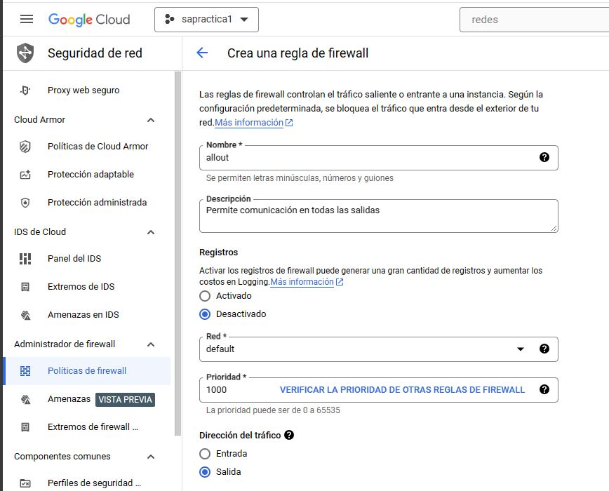

## Librerias
Crear un entorno virtual
~~~
pip install virtualenv
virtualenv venv
~~~

## API 1
Consumira [Agify](https://agify.io/documentation)

Activar entorno virtual
~~~
venv/Scripts/activate
~~~
Instalar las librerias
# Librerias
~~~
pip install Flask mysql-connector-python
pip install flask-cors
pip install requests
~~~
Crear archivo de requerimientos
~~~
pip freeze > requirements.txt
~~~

## API 2
Consumira [Genderize ](https://genderize.io/documentation)

Activar entorno virtual
~~~
venv/Scripts/activate
~~~
Instalar las librerias
# Librerias
~~~
pip install Flask mysql-connector-python
pip install flask-cors
pip install requests
~~~
Crear archivo de requerimientos
~~~
pip freeze > requirements.txt
~~~

## Kubernetes
### Activar Kubernetes
Crear un nuevo proyecto en GCP


Habilitar "Kubernetes Engine API" en google cloud


Al activarse completamente nos mostrara el siguiente menú:


### Reglas de Firewall

Se creara una regla de entrada que permita toda la comunicación


Se creara una regla de salidad que permita toda la comunicación



## Creacion de cluster de kubernetes

**Nombre del cluster:** cluster-prueba

**Numero de nodos(1):** --num-nodes=1

**Tipo de VM (2 CPUs, 8GB RAM):** --machine-type=n1-standard-2

**Nota:** Requerimientos minimos 1 CPUs y 4GB RAM, y 3 nodos

**Networks rules (allin, allout):** --tags=allin,allout

**Autenticacion con certificado:** --enable-legacy-authorization --issue-client-certificate

Habilitar el escalado automatico (Minimo de nodos 1 y maximo 3): --enable-autoscaling --min-nodes=1 --max-nodes=3
```
gcloud container clusters create cluster-sa --num-nodes=1 --tags=allin,allout --enable-legacy-authorization --issue-client-certificate --preemptible --machine-type=n1-standard-2
```
Al ejecutarse el comando pedira permisos:


## Comandos

 GCloud SDK

### Ubuntu
 
Descarga el paquete del GCloud SDK
```
curl -O https://dl.google.com/dl/cloudsdk/channels/rapid/downloads/google-cloud-sdk-367.0.0-linux-x86_64.tar.gz
```

Desempaquetar 
```
tar zxvf google-cloud-sdk-367.0.0-linux-x86_64.tar.gz
```
Iniciar la Instalacion
```
./google-cloud-sdk/install.sh
```
Iniciar la Instalacion
```
kubectl version
```


### **Nota Importante: Luego de ejecutarlos todos cerrar y abrir una terminal nueva.**

-----------
## Configurar gcloud sdk
```
gcloud init
```

Configurar el proyecto y la region por defecto. Utilizar el id de su proyecto.

```
gcloud config set project so1p2-403617
```
Configurar la Zona horaria
```
gcloud config set compute/zone us-central1-a
```
-----------
## Instalar Kubectl
```
gcloud components install kubectl
```


-----------
## Creacion de cluster de kubernetes

**Nombre del cluster:** cluster-prueba

**Numero de nodos(1):** --num-nodes=1

**Tipo de VM (2 CPUs, 8GB RAM):** --machine-type=n1-standard-2

**Nota:** Requerimientos minimos 2 CPUs y 4GB RAM, y 3 nodos

**Networks rules (allin, allout):** --tags=allin,allout

**Autenticacion con certificado:** --enable-legacy-authorization --issue-client-certificate

Habilitar el escalado automatico (Minimo de nodos 1 y maximo 3): --enable-autoscaling --min-nodes=1 --max-nodes=3
```
gcloud container clusters create cluster-sopes1 --num-nodes=1 --tags=allin,allout --enable-legacy-authorization --issue-client-certificate --preemptible --machine-type=n1-standard-2
```

-----------
## Obtener credenciales para Kubectl

Entrar en la página de GCP a la configuración del cluster, luego presionar el botón Connect y copiar y pegar la conexión en una terminal. Ejemplo
```
gcloud container clusters get-credentials k8s-demo --zone us-central1-a --project so1-2s22
```

-----------
## Comanodos utiles de kubectl

Listar los nodos
```
kubectl get nodes
```
#Listar los namespaces
```
kubectl get namespaces
```
Listar los pods
```
kubectl get pods
```
Servicios
```
kubectl get services -n <nombre_servicio>
kubectl delete services -n <nombre_servicio>
```
Deployments
```
kubectl get deployments -n <nombre_deployment>
kubectl delete deployments -n <nombre_deployment>
```
---------
## Archivos de configuracion de Kubernetes
```
kubectl get [nodes|deployments|services|pods] nombre -o yaml > pod.yaml
kubectl create -f archivo.yaml
kubectl delete -f archivo.yaml
kubectl apply -f archivo.yaml
```
---------
## Monitoreo
```
kubectl logs -f pod/name
kubectl logs -f deployment/name
kubectl describe deployments name
```

## Instalar Helm y Crear nginx para uso de ingress
Crear un namespace para ingress y uso de helm que servirá como gestor de los paquetes de k8s para el manejo de ingress con nginx.

```
kubectl create ns nginx-ingress
helm repo add ingress-nginx https://kubernetes.github.io/ingress-nginx 
helm repo update 
helm install nginx-ingress ingress-nginx/ingress-nginx -n nginx-ingress
helm list -n nginx
```
Comando para visualizar los servicios que se tendrán dentro del namespace de nginx.
```
kubectl get services -n nginx-ingress
```
### Optenemos IP Externa
Obtenemos la IP externa por donde ingresan los datos
```
kubectl get svc -n nginx-ingress
```

### configuraciòn del namespace
Debemos ir a conectar a google

Copiar el enlace a la terminal donde esta nuestro namespace

```
gcloud container clusters get-credentials cluster-sopes1 --zone us-central1-a --project so1p2-403617
```
crear nuestro namespace

```
kubectl apply -f namespace.yaml
```


verificar que se creo
```
kubectl get namespace
```


### Crear un pod
```
kubectl apply -f app_python.yml
```
Ver si se creo 
```
kubectl get pods -n so1p2
```

### Servicio
```
kubectl apply -f service.yml
```
Ver si se creo 
```
kubectl get service -n so1p2
```


### Exponer el puerto
Ver si se creo 
```
kubectl apply -f basic-ingress.yml
```
Ver si se creo 
```
kubectl get Ingress -n so1p2
```
